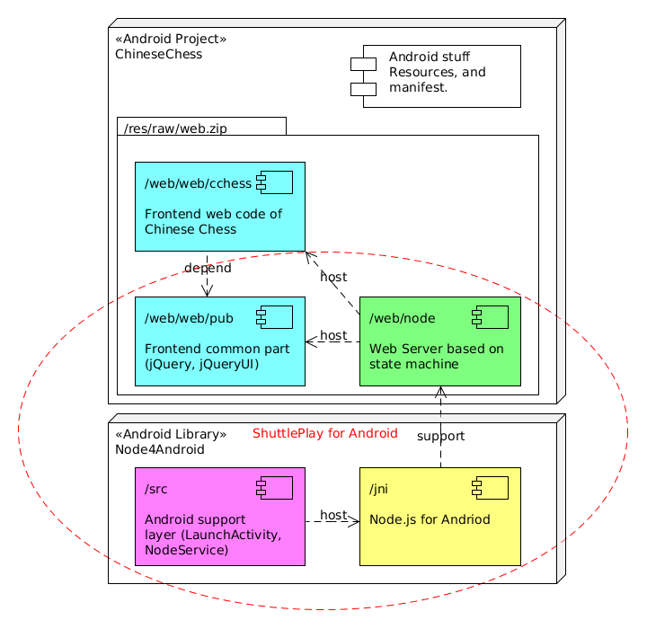

# Chinese Chess of ShuttlePlay

## Overview

Chinese Chess is the first web page game based on [node4android](https://github.com/zhentao-huang/node4android). 

It is essentially a demonstration. It's either a template project for [ShuttlePlay](http://shuttleplay.net) game framework.

ShuttlePlay is for multi-players game with multiple mobile devices. I called it "One installation, Multiple devices play together".

## Advantage

When you launch Chinese Chess, you would find it's very easy for you and your opponent. 
You would see a QR code appeared on your device. And your opponent is just use any other mobile device to scan the code, then the game starts!

Your opponent need neither installs same game, nor cares about which kind of his device (iOS, Android, ...). It just works!

## Design

The game has no UI components, because UI is in a browser i.e. Chrome, It's just a web server hosting a page game.

## How to build
The project depends on [node4android](https://github.com/zhentao-huang/node4android). 
So you need load these two projects in same workspace of Eclipse, and setup dependency.
    Open Chinese Chess project "Properties", choose "Andorid", in "Library" list add "NodeAndroid"

For Chinese Chess project, there is no any code in src folder
But there is a folder called web. you need enter the folder zip them 
    $ cd web
    $ zip -r ../res/raw/web.zip "*" -x "*/.git/*" ".*"

Then build both project and package Chinese Chess.

## License
The project is conform MIT License

